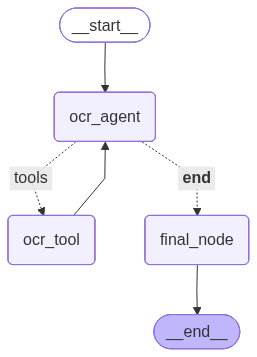

# OCR Agent

An elegant, agentic OCR pipeline built with LangGraph and LangChain for extracting text from images, scanned documents, and PDFs, including handwritten content.

The project combines a reasoning layer with a dedicated OCR tool, allowing the agent to decide when text extraction is needed and to return clean transcriptions while also saving results to disk.

## Overview

`ocr-agent` uses a LangGraph state machine to orchestrate OCR as an agent workflow instead of a single direct function call. The agent receives an asset path and a user instruction, evaluates the request, invokes the OCR tool when needed, and returns the extracted text.

This design makes the project easy to extend for:

- multi-step document workflows
- validation or post-processing stages
- structured extraction pipelines
- human-in-the-loop review steps

## Architecture

The LangGraph workflow consists of two core nodes:

- `ocr_agent`: the reasoning node powered by `ChatOpenAI`
- `ocr_tool`: a tool execution node that runs the OCR extraction function

The flow starts at the agent node. If the model determines that OCR is required, LangGraph routes execution to the tool node. After the tool runs, control returns to the agent, which can then respond with the extracted content.

### LangGraph Diagram



## OCR Process

The OCR pipeline implemented in this repository follows these steps:

1. The application starts in [main.py](/Users/anuborah@sphnet.com.sg/IdeaProjects/ocr-agent/main.py) and loads environment variables with `python-dotenv`.
2. A LangGraph `StateGraph` is created using the shared state type defined in [ocr_types/agent_type.py](/Users/anuborah@sphnet.com.sg/IdeaProjects/ocr-agent/ocr_types/agent_type.py).
3. The state includes:
   - `asset_path`: the input file to process
   - `messages`: the running conversation state for the agent
4. The `ocr_agent` node receives the current state and injects a system instruction telling the model that it is an OCR assistant and that it may use the OCR tool.
5. If the model decides that text extraction is needed, LangGraph routes execution to the tool node through `tools_condition`.
6. The `extract_text` tool in [agent/tools.py](/Users/anuborah@sphnet.com.sg/IdeaProjects/ocr-agent/agent/tools.py):
   - reads the file from disk
   - converts the file into Base64
   - maps the file extension to the correct MIME type
   - sends the document to a vision-capable `gpt-4o` model
   - asks the model to return only the extracted text
7. The extracted text is written to the `output/` directory using the source filename, for example `output/hand-written.txt`.
8. The tool returns the text to the graph, and the agent completes the interaction with the OCR result in state.

## Project Structure

```text
ocr-agent/
├── agent/
│   └── tools.py              # OCR tool implementation
├── assets/
│   └── hand-written.png      # Sample input asset
├── ocr_types/
│   └── agent_type.py         # Shared LangGraph state definition
├── output/
│   └── hand-written.txt      # Sample OCR output
├── main.py                   # Graph assembly and execution entrypoint
├── pyproject.toml            # Project metadata and dependencies
└── state_graph_ocr.png       # Generated LangGraph architecture diagram
```

## Tech Stack

- Python 3.11+
- LangGraph
- LangChain
- LangChain OpenAI
- `gpt-4o` vision model
- `python-dotenv`

## Supported Inputs

The OCR tool currently recognizes these file types:

- `.png`
- `.jpg`
- `.jpeg`
- `.webp`
- `.pdf`

Unknown file types fall back to `application/octet-stream`.

## How To Run

### 1. Install dependencies

If you are using `uv`:

```bash
uv sync
```

Or with `pip`:

```bash
pip install -e .
```

### 2. Configure environment variables

Create a `.env` file in the project root:

```env
GITHUB_TOKEN=your_token_here
```

The current implementation uses:

- Azure-hosted inference endpoint via `base_url="https://models.inference.ai.azure.com"`
- `GITHUB_TOKEN` as the API credential

### 3. Run the example

```bash
python main.py
```

By default, the script processes:

```text
assets/hand-written.png
```

and saves the extracted text to:

```text
output/hand-written.txt
```

## Example Execution Flow

When `main.py` runs:

1. the graph is compiled
2. the LangGraph Mermaid diagram is generated
3. the diagram is exported as `state_graph_ocr.png`
4. the sample image is passed into the workflow
5. the OCR tool extracts and stores the transcription

## Design Highlights

- Agentic workflow rather than a one-off OCR function
- Clear separation between reasoning and tool execution
- Reusable typed graph state
- Persisted output for downstream processing
- Ready for extension into richer document understanding pipelines

## Extension Ideas

This codebase is a strong starting point for adding:

- multi-page PDF chunking
- confidence scoring or verification
- markdown or JSON structured output
- key-value extraction from forms
- table detection and extraction
- batch OCR processing

## Notes

- The current sample execution path is hardcoded in [main.py](/Users/anuborah@sphnet.com.sg/IdeaProjects/ocr-agent/main.py).
- The OCR tool writes plain text files to `output/`.
- The graph image is generated programmatically each time the script runs.
