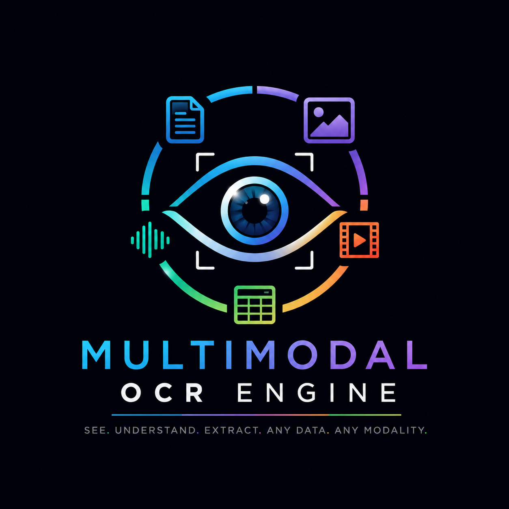
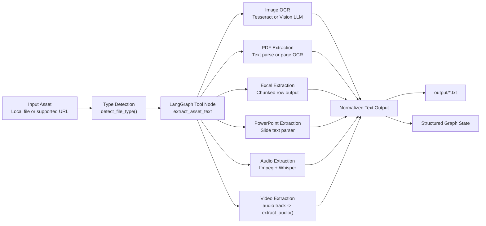
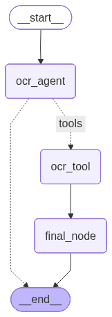

# Multimodal OCR Engine



A professional, graph-driven OCR and transcription engine built with LangGraph and LangChain for extracting text from documents, images, spreadsheets, presentations, audio, video, and supported remote URLs.

The system routes each input through the right extraction path, persists the extracted result under `output/`, and returns structured metadata that is ready for downstream automation, audit workflows, or enrichment pipelines.

## Executive Summary

`Multimodal OCR Engine` is designed as an orchestration workflow rather than a single OCR utility. Instead of forcing every file through the same path, the engine:

- detects the asset type
- selects the correct extractor
- handles local files and supported URLs
- writes normalized text output to disk
- returns structured state through a LangGraph workflow

This makes the project well suited for production-style document intake, audit support, content extraction, and multimodal transcription pipelines.

## Key Capabilities

- OCR for handwritten and printed images
- PDF extraction with both direct text parsing and OCR fallback
- Excel extraction with row-based chunking for large sheets
- PowerPoint slide text extraction
- Audio transcription with preprocessing and Whisper backends
- Video transcription by extracting the audio track and reusing the audio pipeline
- URL-based extraction for supported image, PDF, audio, and video inputs
- Structured LangGraph state for clean downstream integration

## Architecture

The engine is organized into three logical layers:

- Orchestration layer: LangGraph workflow in [main.py](/Users/anuborah@sphnet.com.sg/IdeaProjects/ocr-agent/main.py)
- Extraction layer: media-specific extractors in [agents/extractors.py](/Users/anuborah@sphnet.com.sg/IdeaProjects/ocr-agent/agents/extractors.py)
- Vision/tooling layer: LangChain tool wrapper and vision-LLM helpers in [agents/tools.py](/Users/anuborah@sphnet.com.sg/IdeaProjects/ocr-agent/agents/tools.py) and [agents/vision_llm.py](/Users/anuborah@sphnet.com.sg/IdeaProjects/ocr-agent/agents/vision_llm.py)

### Architecture Diagram



### LangGraph Workflow

The current graph is intentionally simple and robust:

- `ocr_agent`: decides whether tool execution is required
- `ocr_tool`: runs the extraction tool
- `final_node`: parses the tool payload and writes the final structured result into state

Graph image:



## Processing Flow

The extraction workflow follows these steps:

1. [main.py](/Users/anuborah@sphnet.com.sg/IdeaProjects/ocr-agent/main.py) builds a `StateGraph` using the typed state defined in [ocr_types/agent_type.py](/Users/anuborah@sphnet.com.sg/IdeaProjects/ocr-agent/ocr_types/agent_type.py).
2. The graph state tracks:
   - `asset_path`
   - `file_type`
   - `image_text_type`
   - `extracted_text`
   - `output_path`
   - `messages`
3. The `ocr_agent` node prompts the LLM to call `extract_asset_text` when extraction is required.
4. [agents/tools.py](/Users/anuborah@sphnet.com.sg/IdeaProjects/ocr-agent/agents/tools.py) validates the asset, detects the type, invokes the correct extractor, and writes the result to `output/<asset-name>.txt`.
5. [agents/extractors.py](/Users/anuborah@sphnet.com.sg/IdeaProjects/ocr-agent/agents/extractors.py) dispatches to the relevant media extractor.
6. `final_node` returns the normalized extraction result without sending the full extracted body back into the LLM, which prevents oversized follow-up requests for large files such as spreadsheets.

## Supported Inputs

| Category | Supported Types |
| --- | --- |
| Images | `.png`, `.jpg`, `.jpeg`, `.webp`, `.bmp`, `.tiff` |
| PDFs | `.pdf` |
| Text/Data | `.txt`, `.md`, `.json`, `.xml`, `.html`, `.csv`, `.yaml`, `.yml` |
| Word | `.docx` |
| Excel | `.xlsx`, `.xls` |
| PowerPoint | `.pptx` |
| Audio | `.mp3`, `.wav`, `.m4a`, `.aac`, `.flac`, `.ogg` |
| Video | `.mp4`, `.mov`, `.avi`, `.mkv`, `.webm` |
| Remote URLs | Supported for image, PDF, audio, and video flows |

## Repository Structure

```text
ocr-agent/
├── agents/
│   ├── extractors.py         # Media-specific extraction logic
│   ├── tools.py              # LangChain tool wrapper and output writer
│   └── vision_llm.py         # Vision LLM helpers for image classification and handwriting OCR
├── assets/                   # Sample local inputs
├── images/github/            # README visuals
├── ocr_types/                # Typed LangGraph state
├── output/                   # Generated extraction outputs
├── tests/                    # Pytest coverage
├── main.py                   # LangGraph workflow entrypoint
├── pyproject.toml            # Dependencies and tool configuration
└── .pre-commit-config.yaml   # Pre-commit automation
```

## Bundled Sample Assets

The repository currently ships with representative multimodal examples:

| Asset | Type | Generated Output |
| --- | --- | --- |
| `assets/hand-written.png` | Handwritten image | `output/hand-written.txt` |
| `assets/cursive_writing.pdf` | PDF worksheet | `output/cursive_writing.txt` |
| `assets/audit-excel.xlsx` | Excel workbook | `output/audit-excel.txt` |
| `assets/ocr.pptx` | PowerPoint deck | `output/ocr.txt` |
| `assets/bryan-adams-cloud-9.mp3` | Audio sample | `output/bryan-adams-cloud-9.txt` |
| `assets/bryan-adams-summer-of-69.mp4` | Video sample | `output/bryan-adams-summer-of-69.txt` |

## Sample Output

The snippets below are taken from the actual files currently present in `output/`.

### Handwritten Image

Asset: [hand-written.png](/Users/anuborah@sphnet.com.sg/IdeaProjects/ocr-agent/assets/hand-written.png)  
Output: [hand-written.txt](/Users/anuborah@sphnet.com.sg/IdeaProjects/ocr-agent/output/hand-written.txt)

```text
Lorem ifsum dolor sit amet, consectetur

adifiscing Chit. Morbi dolor Libero, rhoncus et
sapien vitae, voluthat cowallis lectus. Etiam
lobortis eget facus id maximus.
```

### PDF

Asset: [cursive_writing.pdf](/Users/anuborah@sphnet.com.sg/IdeaProjects/ocr-agent/assets/cursive_writing.pdf)  
Output: [cursive_writing.txt](/Users/anuborah@sphnet.com.sg/IdeaProjects/ocr-agent/output/cursive_writing.txt)

```text
--- PAGE 1 | printed_image ---
Kidde, Cursive Writing Practice

Worksheet

Name : Date :
```

### Excel

Asset: [audit-excel.xlsx](/Users/anuborah@sphnet.com.sg/IdeaProjects/ocr-agent/assets/audit-excel.xlsx)  
Output: [audit-excel.txt](/Users/anuborah@sphnet.com.sg/IdeaProjects/ocr-agent/output/audit-excel.txt)

```text
=== SHEET: Data ===

--- ROWS 1 TO 200 OF 500 ---
Transaction_ID       Date    Category        Account_Name Department
     TXN-10000 04/13/2025     Expense            Salaries        R&D
     TXN-10001 08/03/2025     Revenue     Consulting Fees Operations
```

### PowerPoint

Asset: [ocr.pptx](/Users/anuborah@sphnet.com.sg/IdeaProjects/ocr-agent/assets/ocr.pptx)  
Output: [ocr.txt](/Users/anuborah@sphnet.com.sg/IdeaProjects/ocr-agent/output/ocr.txt)

```text
--- SLIDE 1 ---

State of and Trends in OCR Technology
By Jim Hill, Solutions Specialist
```

### Audio

Asset: [bryan-adams-cloud-9.mp3](/Users/anuborah@sphnet.com.sg/IdeaProjects/ocr-agent/assets/bryan-adams-cloud-9.mp3)  
Output: [bryan-adams-cloud-9.txt](/Users/anuborah@sphnet.com.sg/IdeaProjects/ocr-agent/output/bryan-adams-cloud-9.txt)

```text
Clue number one was when you knocked on my door.
Clue number two was the look that you wore.
And that's when I knew it was a pretty good sign.
```

### Video

Asset: [bryan-adams-summer-of-69.mp4](/Users/anuborah@sphnet.com.sg/IdeaProjects/ocr-agent/assets/bryan-adams-summer-of-69.mp4)  
Output: [bryan-adams-summer-of-69.txt](/Users/anuborah@sphnet.com.sg/IdeaProjects/ocr-agent/output/bryan-adams-summer-of-69.txt)

```text
I got my first real six string
Bought it at the five and dime
Played it till my fingers bled
Was the summer of 69
```

## Installation

### Python Dependencies

Using `uv`:

```bash
uv sync
```

Using `pip`:

```bash
pip install -e .[dev]
```

### Environment Variables

Create a `.env` file in the project root:

```env
GITHUB_TOKEN=your_token_here
```

### Native Requirements

For audio and video extraction on macOS:

```bash
brew install ffmpeg
```

Tesseract is also required for printed-image OCR paths.

## Usage

Run the workflow with:

```bash
python main.py
```

By default, [main.py](/Users/anuborah@sphnet.com.sg/IdeaProjects/ocr-agent/main.py) points at a bundled Excel asset and will:

1. generate the workflow diagram
2. execute extraction
3. write the extracted output under `output/`
4. return structured metadata through the graph

## Testing And Quality Gates

Run tests directly:

```bash
pytest
```

Install git hooks:

```bash
pre-commit install --hook-type pre-commit --hook-type commit-msg --hook-type pre-push
```

Run the full local quality suite:

```bash
pre-commit run --all-files
```

Configured checks include:

- `pre-commit-hooks`
- `ruff`
- `black`
- conventional commit validation
- `pytest`

## Design Notes

- Large Excel workbooks are chunked by row range to keep output manageable.
- Video transcription is implemented by extracting the audio track and reusing `extract_audio()`.
- Supported remote assets are downloaded to temporary storage and cleaned up automatically.
- Heavy dependencies are imported lazily where possible to reduce import-time fragility.
- Final graph routing avoids sending large extraction bodies back through the LLM, which prevents token-limit failures on files such as spreadsheets.

## Technology Stack

- Python 3.11+
- LangGraph
- LangChain
- LangChain OpenAI
- `gpt-4o`
- Tesseract OCR
- Whisper / Faster-Whisper
- PyMuPDF
- `ffmpeg`
- `yt-dlp`
- `python-dotenv`
